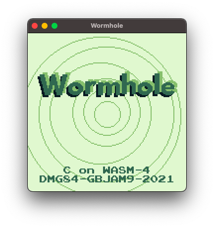

# Wormhole
A [GBJAM9](https://itch.io/jam/gbjam-9) entry written in C for the [WASM-4 fantasy console](https://wasm4.org/). WASM-4 allows you to write games in C, compile to WebAssembly, and run them in the browser: [Play it on wasm4.org](https://wasm4.org/play/wormhole).

This is game jam code of questionable quality. To build it, you will need the the [WASI SDK](https://github.com/WebAssembly/wasi-sdk) installed and the `WASI_SDK_PATH` environmental variable set.